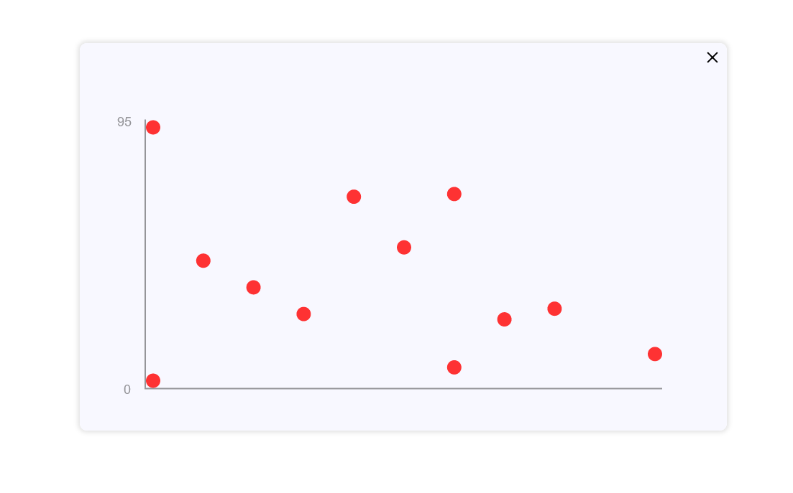

# Window Engine.js

`window-engine.js` allows the user to wrap content in a movable and closable window.

## Usage

```javascript
let my_win = new Window(window_height, window_width, pos_x, pos_y);
my_win.frame.appendChild(content);
```

